# Production Agentic Vision System for Construction Safety

This repository is the foundation for an enterprise, evidence-first construction-safety platform. The prior MVP implementation is preserved on the `old-dev` branch.

> **Status:** The structure and architecture below are the target production design. Services are scaffolded but not yet implemented.

## Architecture

The system is asynchronous and evidence-first. An upload creates a durable inspection job; specialist workers inspect only relevant regions; a decision gate produces either a reviewable event or a human-in-the-loop (HITL) task. AI output is never itself proof of an OSHA violation.

```mermaid
flowchart LR
    LOGIN[User Login<br/>SSO and JWT access] --> DASH[Safety Dashboard<br/>Jobs and safety trends]
    DASH --> UPLOAD[Media Upload<br/>Image or video frame]
    UPLOAD --> GATEWAY[API Gateway<br/>Auth, quotas, file limits]
    GATEWAY --> CACHE[(Redis<br/>Rate limits and idempotency)]
    GATEWAY --> INGEST[Ingestion API<br/>Validate and create job]
    INGEST --> STORE[(Object Storage<br/>Originals, crops, overlays)]
    INGEST --> JOBS[(PostgreSQL<br/>Jobs, events, HITL decisions)]
    INGEST --> REQUEST[[Kafka Request Topic<br/>inspection.requested]]

    REQUEST --> SCENE[Agent 1: Scene Analyzer<br/>GPT-4o scene processing]
    SCENE --> ROUTE[ROI Router<br/>Route relevant regions]
    ROUTE --> PPE[Agent 2: PPE Inspector<br/>Gemini Flash PPE check]
    ROUTE --> SCAFF[Agent 3: Scaffold Inspector<br/>Gemini Flash scaffold check]
    ROUTE --> PROX[Agent 4: Proximity Inspector<br/>Gemini Flash proximity check]
    PPE --> EVIDENCE[[Kafka Evidence Topic<br/>evidence.candidate]]
    SCAFF --> EVIDENCE
    PROX --> EVIDENCE

    EVIDENCE --> SYNTH[Evidence Synthesizer<br/>GPT-4o reconciles claims]
    SYNTH --> OSHA[OSHA Retrieval<br/>Find applicable OSHA criteria]
    OSHA --> RAG[(Milvus RAG<br/>OSHA corpus and embeddings)]
    RAG --> JUDGE[LLM-as-a-Judge<br/>Evaluate evidence and citation]
    JUDGE --> DECIDE[Decision Gate<br/>Confidence and severity policy]
    DECIDE --> RENDER[Evidence Renderer<br/>Deterministic annotation overlay]
    RENDER -->|Accepted evidence| EVENT[Safety Event<br/>Violation and visual proof]
    DECIDE -->|Uncertain / high severity| REVIEW[HITL Review<br/>Confirm, correct, dismiss]
    EVENT --> JOBS
    EVENT --> STORE
    REVIEW --> JOBS
    JOBS --> DASH
```

## User Flow

1. **Sign in:** A safety manager signs in through the web app; the API Gateway validates identity, role, tenant, and quota.
2. **Open dashboard:** The user sees open inspections, recent safety events, trends, and the HITL review queue.
3. **Upload media:** The user uploads a jobsite image or chooses a video frame; ingestion validates it and creates an inspection job.
4. **Track processing:** The dashboard shows live job status while Kafka-driven workers analyze the scene, inspect routed ROIs, retrieve OSHA criteria, and evaluate evidence.
5. **Review results:** The user sees an annotated image, candidate violation, severity, confidence, and cited OSHA excerpt.
6. **Resolve findings:** Accepted events are retained in the audit trail; uncertain or high-severity findings go to HITL for confirmation, correction, dismissal, or an insufficient-evidence decision.

## Project Structure

| Directory | Owns |
| --- | --- |
| `apps/web` | React dashboard, upload, inspection status, overlays, and HITL review. |
| `src/api-gateway` | OIDC/JWT auth, tenant isolation, rate limits, and Redis idempotency. |
| `src/ingestion` | Media validation, object storage, job creation, and Kafka publishing. |
| `src/*-inspector` | Independently scalable specialist inspection workers. |
| `src/osha-retrieval` | Hybrid BM25 and Milvus retrieval over versioned OSHA content. |
| `src/llm-judge` | Evidence-to-claim and citation relevance evaluation. |
| `src/decision-gate` | Confidence, severity, and HITL policy enforcement. |
| `src/evidence-renderer` | Deterministic annotation generation from validated ROIs and event metadata. |
| `src/hitl-service` | Reviewer assignment, action capture, and audit records. |
| `packages/contracts` | Versioned API and Kafka schemas. |
| `infra` | Local development and Kubernetes deployment assets. |
| `docs` | ADRs and operational runbooks. |
| `evals` | Golden data, scenarios, and evaluation reports. |
| `tests` | Contract and end-to-end integration tests. |

## Event contracts

Kafka messages use versioned schemas. Every event contains `event_id`, `trace_id`, `tenant_id`, `inspection_id`, `schema_version`, and `occurred_at`.

| Topic | Producer → consumer | Purpose |
| --- | --- | --- |
| `inspection.requested.v1` | Ingestion → scene analyzer | Starts durable inspection work. |
| `scene.analyzed.v1` | Scene analyzer → ROI router | Emits entities, context, and normalized ROIs. |
| `roi.routed.v1` | ROI router → specialist workers | Sends a relevant region and narrow task. |
| `evidence.candidate.v1` | Specialists → synthesizer | Observation, ROI, rationale, confidence, and abstention. |
| `safety.event.created.v1` | Decision gate → dashboard/integrations | Publishes an accepted reviewable event. |
| `review.requested.v1` | Decision gate → HITL service | Routes uncertain, conflicting, or policy-mandated review. |
| `*.dlq.v1` | Any consumer → operations | Retains poison events after bounded retries. |

## Safety, confidence, and HITL policy

- Treat model output as a **candidate observation**, never as a confirmed safety or legal finding.
- Accept an event only when visual evidence is present, the OSHA citation is relevant, outputs do not conflict, and calibrated thresholds pass.
- Require HITL for high severity, conflict, missing/occluded evidence, weak retrieval, new model/prompt versions, or review-band confidence.
- The Evidence Renderer uses deterministic tooling such as OpenCV or Pillow. Models return coordinates and evidence; they never draw annotations themselves.
- Preserve originals, ROI crops, prompts, model versions, retrieved passages, output schemas, reviewer actions, and event versions for auditability.

## Data and security requirements

- PostgreSQL is the tenant-scoped system of record; enforce Row Level Security.
- Object storage holds originals and rendered annotations; use short-lived signed URLs, retention/deletion policy, and encryption in transit/at rest.
- Keep Kafka, PostgreSQL, Redis, Milvus, and workers private. Expose only the web application and API Gateway.
- Validate MIME type, byte/pixel limits, decompression-bomb risk, content hashes, and malware before creating a job.
- Use idempotency keys at the gateway; use idempotent consumers and bounded retry/DLQ behavior in the workflow.

## Tokenomics and cost controls

These are **initial planning targets**; calibrate them against actual provider pricing and production measurements before launch.

| Stage | Primary service | Target cost / inspection | Cost control |
| --- | --- | ---: | --- |
| Scene analysis | GPT-4o | ≤ $0.04 | One compressed image per inspection. |
| Specialist checks | Gemini Flash | ≤ $0.06 | Run only agents selected by the ROI router. |
| Synthesis + judge | GPT-4o | ≤ $0.03 | Send compact evidence, not duplicate full images. |
| OSHA retrieval | BM25 + Milvus | ≤ $0.005 | Cache embeddings and retrieval queries. |
| **Total target** | — | **≤ $0.15** | Stop at budget; route unresolved work to HITL. |

- Set `max_cost_usd` and `max_model_calls` on every inspection job.
- Crop and downscale ROIs before specialist calls.
- Cache image hashes, embeddings, and OSHA results where policy permits.
- Reserve GPT-4o for scene analysis, conflicts, and judge evaluation; use Gemini Flash for routine specialist checks.

## Evaluation and release gates

Maintain a fixed, versioned, labeled benchmark covering PPE, scaffolds, equipment proximity, difficult lighting, occlusion, crowded sites, and no-violation scenes. Evaluate every model, prompt, routing, and corpus change against the current production baseline.

| Metric | Initial target | Release gate |
| --- | ---: | --- |
| PPE recall | ≥ 95% | No regression greater than 2 percentage points. |
| PPE precision | ≥ 85% | No regression greater than 2 percentage points. |
| OSHA citation groundedness | ≥ 95% | Block release below target. |
| Bounding-box IoU | ≥ 0.60 | Review any drop below target. |
| HITL overturn rate | ≤ 15% | Investigate by violation category. |
| P95 completion latency | ≤ 20 seconds | Block sustained regressions. |
| Cost per inspection | ≤ $0.15 | Alert and throttle above budget. |

- Evaluate every violation type separately; aggregate metrics can hide dangerous failure modes.
- Require a blinded HITL sample to measure real-world agreement.
- Treat high-severity false negatives as a separate release-blocking metric.

## Observability and audit trail

Create one trace per inspection, keyed by `inspection_id` and `trace_id`, including:

- Tenant, user role, image hash, timestamp, and pipeline state.
- ROI coordinates, routing decision, specialist calls, and abstentions.
- Prompt/model versions, tokens, cost, latency, retries, and provider errors.
- Retrieved OSHA passages, Milvus similarity, selected citation, synthesis confidence, and judge score.
- Event version, rendered-evidence URI, HITL action, reviewer rationale, and final outcome.

Alert on Kafka consumer lag or DLQ growth, provider failures, P95 latency/cost overruns, citation-groundedness decline, rising HITL overturns, and confidence drift by customer, jobsite, camera type, or violation category.

## Delivery TODO

### Phase 0 — Foundation

- [ ] Add workspace tooling, dependency manifests, formatting, linting, type checking, and test commands.
- [ ] Define environment configuration, secret-management interface, and local development workflow.
- [ ] Create ADRs for service boundaries, Kafka, PostgreSQL, Milvus, and model-provider strategy.

### Phase 1 — Secure ingestion and durable workflow

- [ ] Implement API Gateway authentication, tenant authorization, rate limits, and Redis idempotency.
- [ ] Implement ingestion validation, object-storage upload, PostgreSQL inspection records, and outbox publishing.
- [ ] Define and validate versioned Kafka contracts, consumer idempotency, retry, and DLQ behavior.

### Phase 2 — Evidence pipeline

- [ ] Implement scene analysis, ROI routing, PPE, scaffold, and equipment-proximity workers.
- [ ] Implement evidence synthesis with schema validation, abstentions, and conflicting-evidence handling.
- [ ] Implement Milvus-backed OSHA retrieval and LLM-as-a-Judge evidence/citation evaluation.
- [ ] Implement Decision Gate policy and deterministic Evidence Renderer overlays.

### Phase 3 — Product and HITL

- [ ] Build the dashboard, upload workflow, live inspection status, event history, and annotated evidence view.
- [ ] Build the HITL review queue and immutable confirm/correct/dismiss/insufficient-evidence actions.
- [ ] Enforce PostgreSQL Row Level Security and tenant-aware audit access.

### Phase 4 — Quality and operations

- [ ] Create golden datasets, regression scenarios, contract tests, integration tests, and failure-mode coverage.
- [ ] Add tracing, token/cost accounting, retrieval metrics, model/prompt versioning, alerts, and dashboards.
- [ ] Add CI/CD release gates for quality, groundedness, latency, cost, security, and deployment readiness.

## Build guidance

Read [CODEX.md](CODEX.md) before implementing any component. It is the authoritative guide for agent behavior, contracts, testing, security, evaluation, and definition of done.
