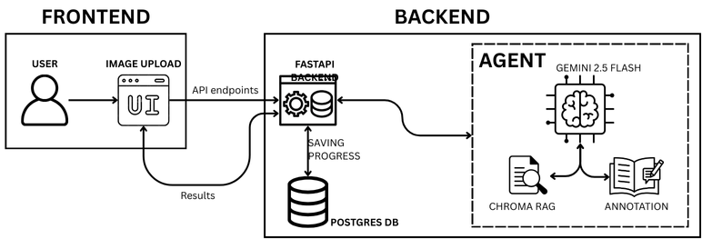

# Vision Safety AI: How I Saved Construction Managers 12 Hours/Week Using vLLMs

## Introduction

Construction is the backbone of US economy, but "bad data" costs the global construction industry over $1.84 trillion annually - [Link to Study](https://www.msuite.com/bad-construction-data-costs-industry-1-8-trillion-worldwide/). I was shocked by this stats, and went directly to the right people to validate it.

After conducting 56 interviews in 3 weeks, the pattern problem was clear among top EPC companies. Thus, I started immediately the implementation to share the MVP with the end-users. Moreover, I was introduced to present the solution at the [BuiltWorlds AI Conference](https://builtworlds.com/news/aiml-demos/#:~:text=context%2Drich%20responses.-,Modalina%20AI,-Modalina%20AI%2C%20a). 

### Problem

**95%** of construction jobsite data goes unused

### Solution

Vision AI Agent saves safety supervisors **~12h per week** by autonomously detecting violations on visual data

### Why Current Solutions Suck

Safety officers spend **15+ hours/week** reviewing footage with clipboards. Inconsistent, slow, and misses violations. Custom computer vision models **cost $100K+ and take at least 3 months to train.** Too expensive for most companies.

### Why Now?

With the recent development of LLMs and ViTs - we can solve the problem in a novel way:

- Accurate on real-world images
- Fast to deploy
- Cheap ($0.01–$0.05 per analysis)

---

## Quick Start

```bash
git clone https://github.com/egorfolley/vision_ai_agent.git
cd vision_ai_agent
cp .env.example .env  # Add your GOOGLE_API_KEY
docker compose up --build
```

- **Frontend**: http://localhost:8501
- **Backend API**: http://localhost:8000/docs

## API Usage

```bash
curl -X POST "http://localhost:8000/analyze" \
  -F "file=@construction_site.jpg"
```

---

## The Tech Implementation

- **Frontend**: Streamlit (simple, fast prototyping)
- **Backend**: FastAPI (Python, async, scalable)
- **Database**: Chroma (vector DB for RAG on safety rules)
- **AI**: LangChain with RAG, powered by Google Gemini 2.5 Flash for vision analysis

## Architecture Overview



**Tech Stack**:

- **Frontend**: Streamlit (Python-based UI)
- **Backend**: FastAPI (REST API)
- **AI Model - Agent:** Google Gemini 2.5 Flash (vision + reasoning)
- **Vector DB**: Chroma (for RAG access)
- **Deployment**: Docker + Docker Compose
- **Storage:** PostgresQL (TO DO)

## User Flow (3 Clicks to Results)

1. **Upload Image**: Drag & drop a jobsite photo
2. **AI Processing**: Tool analyzes (3-5 seconds)
3. **View Results**: Image with annotated violations + the OSHA code references

## How to Run This Project

### Prerequisites

- Docker & Docker Compose installed
- Google API key (for Gemini)

## Contributing

It's a side project - open to feedback!
This is an open-source prototype. Issues and PRs welcome.
